# From CMMS to Agentic EAM

## A practical multi-agent AI architecture for future maintenance platforms

**Paper version:** 0.3  
**Repository type:** research paper + reference architecture + runnable proof-of-concept  
**Inspired by:** experimental interface concepts for a next-generation CMMS system shown below  
**Scope:** CMMS, EAM, work orders, preventive maintenance, inventory, policy, audit, human approval, China smart manufacturing examples, Made in China 2025, graphs, charts, and reproducible figure source data  
**Status:** concept and implementation sketch. The demo does not call an LLM, does not write to a CMMS, and does not automate physical actions.

This repository explores a simple question: what would a trustworthy AI-native CMMS look like if it helped maintenance teams reason before it touched any real system?

Instead of one chatbot doing everything, the concept splits the work across specialist agents. One agent interprets the request, another checks asset context, another checks parts, and another enforces policy. The result is not an automatic write. The result is a review package a human can approve, reject, or revise.

If you are skimming this as a portfolio project, the shortest summary is:

- It is a concept for a next-generation CMMS/EAM system built around multi-agent collaboration.
- It includes a deterministic Python demo that shows the orchestration flow end to end.
- It focuses on governance, explainability, and human approval rather than flashy autonomy.
- It uses China smart-manufacturing examples to show where this model becomes valuable in the real world.

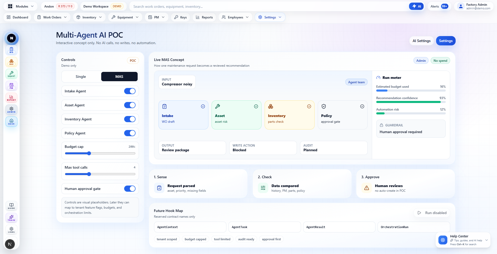

*Figure 1. Experimental next-generation CMMS concept: one maintenance request is reviewed by intake, asset, inventory, and policy agents. The UI exposes budget, confidence, automation risk, and a human approval gate.*

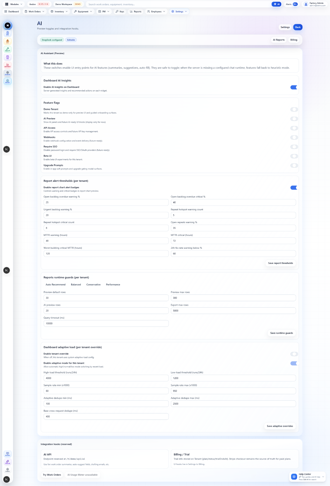

*Figure 2. Experimental CMMS AI settings concept: tenant-scoped feature flags, report thresholds, runtime guards, adaptive load settings, and integration hooks.*


### Visual summary added in v0.3

The v0.3 update adds a larger figure set. The primary figures are generated SVGs so they render cleanly on GitHub and can be regenerated from source data.

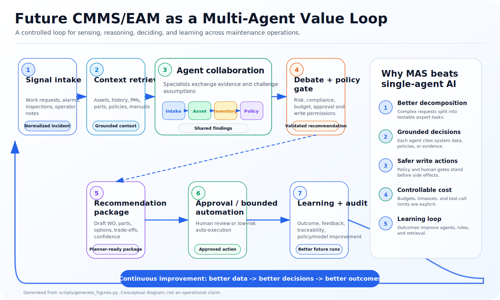

*Figure 3. A future CMMS/EAM platform can be understood as a multi-agent value loop: signal intake, context retrieval, specialist collaboration, debate and policy check, recommendation package, human approval or bounded automation, and learning/audit feedback.*

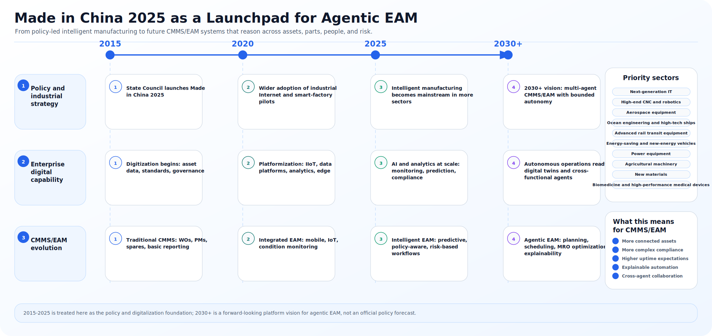

*Figure 4. Made in China 2025, and the broader move from large-scale manufacturing to intelligent manufacturing, create a strong launchpad for agentic EAM because more assets become connected, high-value, safety-sensitive, and data-rich. The 2030+ portion is the paper's forward-looking platform vision, not an official policy forecast.*

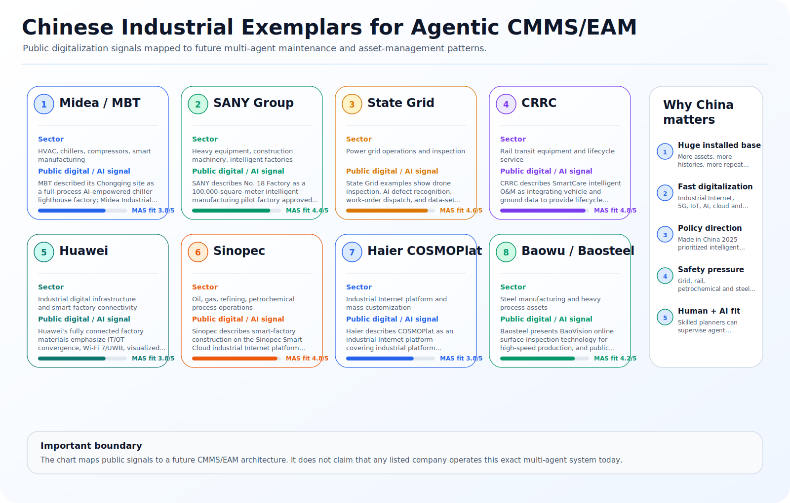

*Figure 5. Public Chinese industrial examples relevant to future CMMS/EAM: Midea/MBT, SANY, State Grid, CRRC, Huawei, Sinopec, Haier COSMOPlat, and Baowu/Baosteel.*

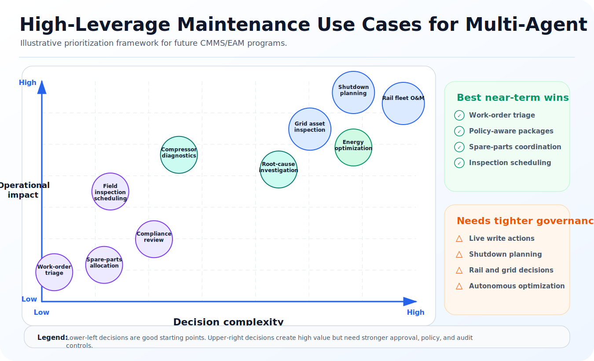

*Figure 6. Multi-agent AI creates the most leverage when a maintenance decision combines high operational impact with high decision complexity. The chart is illustrative, not a measured benchmark.*

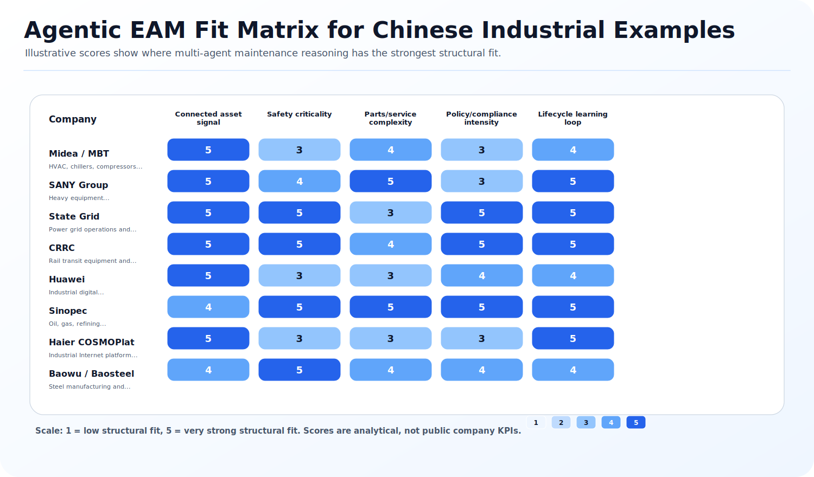

*Figure 7. A qualitative fit matrix for Chinese industrial examples. Scores are analytical design scores, not public company KPIs.*

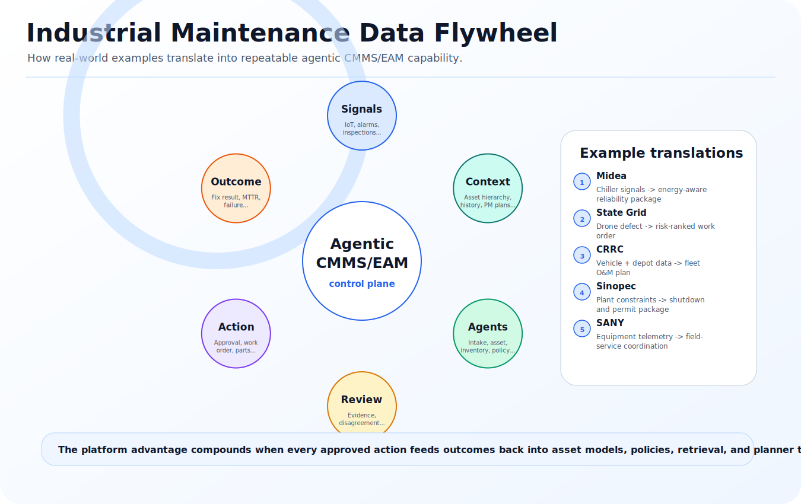

*Figure 8. The long-term platform advantage comes from turning every signal, recommendation, approval, and repair outcome into better future context.*

---

## Abstract

Most CMMS software is good at storing maintenance data, but much weaker at helping people reason across that data. Real maintenance decisions cut across symptoms, asset history, parts, safety rules, downtime cost, and human approval. That is why this project argues for a multi-agent architecture instead of a single all-purpose assistant.

In this concept, each agent has one job. An intake agent structures the request. An asset agent checks risk and history. An inventory agent checks spares and lead times. A policy agent decides whether the system may act or must stop for review. Together they produce a clear recommendation package with evidence, risk, confidence, and approval status.

The key idea is restraint. A useful CMMS AI should help teams make better decisions faster before it starts making changes on their behalf. In this repository, agents can draft and recommend, but live writes stay blocked unless policy, role, tenant settings, and audit requirements allow them.

This v0.3 update adds a China-specific lens plus reproducible graphs and charts. China is a strong proving ground for this idea because connected assets, industrial scale, safety requirements, and intelligent-manufacturing programs all increase the need for explainable, policy-aware maintenance decisions.

---

## Table of contents

1. [Why CMMS/EAM needs multi-agent AI](#1-why-cmmseam-needs-multi-agent-ai)
2. [What the experimental concept gets right](#2-what-the-experimental-concept-gets-right)
3. [The core thesis: controlled delegation](#3-the-core-thesis-controlled-delegation)
4. [Reference architecture](#4-reference-architecture)
5. [Agent roles for future CMMS/EAM](#5-agent-roles-for-future-cmmseam)
6. [The collaboration and debate protocol](#6-the-collaboration-and-debate-protocol)
7. [Data model and agent contracts](#7-data-model-and-agent-contracts)
8. [Governance, safety, and cybersecurity](#8-governance-safety-and-cybersecurity)
9. [Evaluation methodology](#9-evaluation-methodology)
10. [Product roadmap](#10-product-roadmap)
11. [Source code included in this repository](#11-source-code-included-in-this-repository)
12. [Made in China 2025 and real-world Chinese industrial examples](#12-made-in-china-2025-and-real-world-chinese-industrial-examples)
13. [Visual appendix: graphs and charts](#13-visual-appendix-graphs-and-charts)
14. [Closing argument](#14-closing-argument)
15. [References](#references)

---

## 1. Why CMMS/EAM needs multi-agent AI

A CMMS helps teams execute maintenance work. An EAM system goes further and covers the full asset life cycle, from acquisition to replacement. That distinction matters because the next generation of maintenance software cannot stop at recording work orders. It has to connect day-to-day execution with asset risk, cost, policy, and long-term strategy [2][3].

The hard part of maintenance is not that technicians lack forms. It is that real maintenance choices sit between many systems and many kinds of expertise:

- The operator reports symptoms in ordinary language: "compressor noisy", "pump smells hot", "line 2 keeps tripping".
- The asset register knows criticality, location, serial numbers, warranties, and parent-child hierarchy.
- Work history shows whether this is a repeated failure or a new pattern.
- PM plans reveal whether the asset is overdue, recently serviced, or on a bad interval.
- Inventory knows whether likely spares exist, are reserved, or have long lead times.
- Production knows the real cost of downtime.
- Safety and policy determine what can be done, who can do it, and what must be approved.
- Finance cares about spend, capital planning, and maintenance strategy.
- Cybersecurity cares about integration boundaries, especially when AI tools touch OT, historians, gateways, or IoT systems.

Industry 4.0 makes this harder, not simpler. Sensors, telemetry, inspection data, and predictive models create more signals, but they also create more decisions. A future CMMS/EAM platform should not just wait for a work order. It should help interpret weak signals, compare them with history, recommend next steps, and explain why those steps are safe [13].

A single general-purpose AI assistant can help, but it tends to blur roles. It may summarize a request, suggest a part, and mention safety in one response. That feels convenient until the recommendation must be audited. Who checked the spare part? Was the asset criticality considered? Did the model know the tenant policy? Did it confuse a maintenance suggestion with an approved action? Did it use stale information? Did it propose a work order that violates approval rules?

A multi-agent system addresses these questions by design. Each agent has a narrower job, a bounded tool set, a structured output, and visible evidence. The goal is not to create a crowd of chatbots. The goal is to make maintenance reasoning modular enough to test, govern, explain, and improve.

---

## 2. What the experimental concept gets right

The provided interface concepts show a useful product direction because they treat multi-agent AI as an operational control surface, not as a magic text box.

### 2.1 The MAAI screen is a review system, not an automation trap

The MAAI proof-of-concept begins with a simple input: **"Compressor noisy"**. The request flows through four agents:

| Agent | Visible purpose in the concept | Why it matters |
| --- | --- | --- |
| Intake | Work-order draft | Converts human language into a structured maintenance object. |
| Asset | Asset risk | Checks criticality, history, PM status, and likely failure modes. |
| Inventory | Parts check | Prevents recommendations that ignore stock, reservation, and lead time. |
| Policy | Approval gate | Keeps safety, tenant policy, and write permissions in the loop. |

The output is a **review package**. The write action is **blocked**. Audit is **planned**. The run meter shows budget used, recommendation confidence, automation risk, and the guardrail "Human approval required".

That is the right posture. In maintenance, the first credible version of AI should help people make better decisions faster. It should not quietly mutate the system of record. A trustworthy CMMS/EAM agent should be able to say: "Here is the likely work order, here is the evidence, here is the risk, here is the part situation, here is the policy reason I am not writing yet."

### 2.2 The AI settings screen treats AI as tenant-scoped infrastructure

The second screen is equally important. It shows AI settings as an admin area with provider status, feature flags, report thresholds, runtime guards, adaptive load controls, and integration hooks. That means AI is not just a front-end feature. It is tenant-scoped infrastructure with limits, switches, and auditability.

Important details in the screen:

- **Feature flags** for demo tenant, AI preview, API access, webhooks, SSO, beta UI, and upgrade prompts.
- **Report thresholds** for open backlog, repeat hotspots, MTTR, and fix-rate warnings.
- **Runtime guards** such as preview row limits, max rows, export limits, and query timeout.
- **Adaptive load settings** that can change behavior under high load.
- **Integration hooks** such as a reserved AI API path and billing/trial hooks.

This is how serious CMMS/EAM AI should be built. AI features must be controllable per tenant, observable per run, and reversible when risk increases.

---

## 3. The core thesis: controlled delegation

The future CMMS/EAM platform should adopt **controlled delegation**.

Controlled delegation means the system can delegate narrow reasoning tasks to specialized agents while keeping side effects under policy, budget, and human approval. It is not full autonomy. It is also not a passive chatbot. It is a middle path: agents can prepare, check, challenge, draft, and explain; humans and deterministic policy decide when writes are allowed.

A useful rule:

> Agents may recommend and draft by default. Agents may write only when the action is low risk, reversible, idempotent, policy-approved, role-authorized, tenant-enabled, and audited.

This rule should apply whether the write is creating a work order, changing priority, reserving a part, sending a notification, updating PM intervals, opening a purchase request, or pushing data to another enterprise system.

### 3.1 Why not a single assistant?

| Design | Strength | Weakness in CMMS/EAM |
| --- | --- | --- |
| Single AI assistant | Easy to launch, simple UI, low orchestration cost | Blends responsibilities, harder to audit, easy to over-trust, weak separation between suggestion and action. |
| Workflow automation | Reliable for known flows | Brittle when requests are ambiguous, symptoms are informal, or context changes. |
| Multi-agent system | Modular, testable, role-specific, debate-ready, policy-friendly | Requires orchestration, schemas, observability, and careful cost control. |

The multi-agent approach is not always better. For simple tasks such as summarizing a work order, one model call or one deterministic rule may be enough. Multi-agent design earns its cost when the task is cross-functional, ambiguous, high-impact, or requires independent checks.

### 3.2 The maintenance intelligence loop

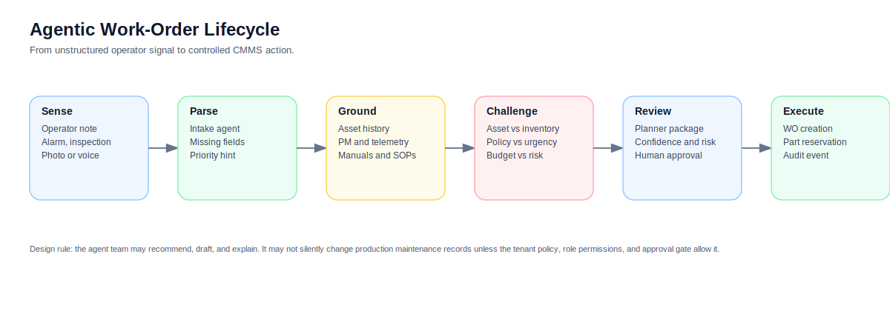

A future CMMS/EAM agent loop should follow six steps:

1. **Sense**: receive a work request, alarm, inspection note, photo, voice note, meter reading, or PM exception.
2. **Parse**: convert the signal into structured fields and ask for missing data when needed.
3. **Ground**: retrieve trusted context from assets, work history, inventory, policies, manuals, telemetry, and user permissions.
4. **Challenge**: let specialized agents expose conflicts, missing evidence, and risk.
5. **Review**: produce a planner-ready package with confidence, risk, proposed actions, and audit trail.
6. **Execute**: perform approved writes through narrow, logged tool calls; learn from the outcome.

This loop fits the reality of maintenance better than a single "answer" because maintenance is a chain of decisions.

---

## 4. Reference architecture

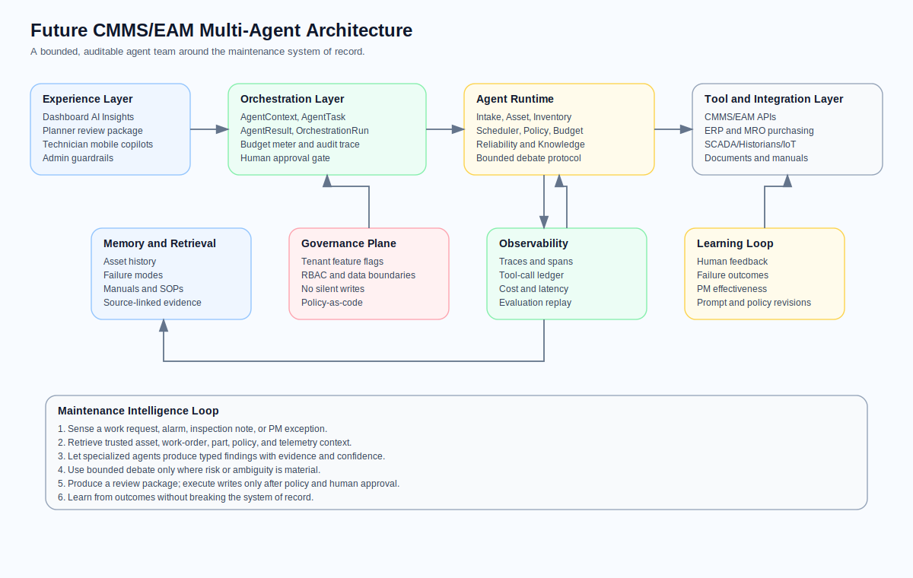

The proposed architecture has five layers.

### 4.1 Experience layer

This is where users see AI. It includes dashboard insights, work-order review packages, mobile technician copilots, planner inboxes, admin settings, and report explanations. The experience layer must make uncertainty visible. It should show confidence, automation risk, source evidence, and what is blocked.

Good CMMS/EAM AI should not hide behind a polished paragraph. It should expose the operational status of the run:

- Which agents participated?
- What evidence did each agent use?
- Which tool calls were made?
- Which writes were proposed?
- Which guardrail blocked or allowed the action?
- What does the human need to approve?

### 4.2 Orchestration layer

The orchestration layer is the agent control tower. It creates an `AgentContext`, assigns `AgentTask` objects, collects `AgentResult` outputs, manages the `OrchestrationRun`, and handles budget, timeouts, retry policy, and audit.

The experimental interface already hints at these reserved contract names: `AgentContext`, `AgentTask`, `AgentResult`, and `OrchestrationRun`. Those names are exactly the right primitives.

A production orchestrator should provide:

- Typed input and output schemas.
- A shared blackboard or run state.
- Tool-call limits and budget caps.
- Role-based access control for tools.
- Tenant boundaries and data isolation.
- Human-in-the-loop checkpoints.
- A trace for every model call, retrieval, tool call, and policy decision.

Open-source and vendor ecosystems are moving in this direction. AutoGen describes customizable conversational agents that can use LLMs, humans, and tools [4]. OpenAI's Agents SDK emphasizes sessions, human-in-the-loop mechanisms, and tracing [17]. LangGraph positions durable execution and human-in-the-loop state control as primitives for long-running agents [18]. The exact framework matters less than the product contract: CMMS/EAM agents need durable, observable orchestration.

### 4.3 Agent runtime

The agent runtime hosts specialized roles. Some agents may be LLM-backed. Some may be deterministic rules. Some may be retrieval-only services. Some may call predictive models. The architecture should not assume that every agent is a chat completion.

A practical runtime should support:

- LLM agents for language-heavy tasks such as intake, summarization, and explanation.
- Retrieval agents for manuals, SOPs, failure modes, and historical work orders.
- Deterministic policy agents for approval gates, RBAC, compliance, and tenant settings.
- Optimization agents for scheduling, routing, and inventory allocation.
- Classifier or forecasting agents for anomaly detection and asset risk.
- Human agents for planner, supervisor, reliability engineer, and technician feedback.

### 4.4 Tool and integration layer

Agents become useful only when they can access the systems where maintenance data lives. That includes CMMS/EAM APIs, inventory, procurement, ERP, MES, SCADA, historians, IoT platforms, document repositories, and identity providers.

Modern agent integration protocols are relevant here. MCP was introduced as an open standard for connecting AI assistants to data sources and tools [15]. A2A was introduced to support interoperability among agents built on different frameworks and vendors [16]. For CMMS/EAM, the lesson is not "adopt every new protocol immediately." The lesson is that agent integration must become standardized, discoverable, and governable.

Maintenance platforms should expose tools through narrow contracts, not broad database access. Examples:

- `get_asset(asset_id)`
- `search_work_history(asset_id, symptoms, time_window)`
- `check_part_availability(part_no, site_id)`
- `draft_work_order(request)`
- `request_part_reservation(part_no, quantity, work_order_id)`
- `get_policy(policy_id, tenant_id)`
- `create_audit_event(run_id, evidence)`

Every tool should specify allowed roles, required scopes, side effects, idempotency behavior, latency budget, and audit fields.

### 4.5 Governance and observability plane

Governance is not a later feature. It is part of the architecture.

The governance plane should enforce:

- Tenant-scoped feature flags.
- AI provider configuration and failover behavior.
- Budget caps and tool-call limits.
- Human approval thresholds.
- Data residency and retention settings.
- Redaction and field-level access controls.
- Prompt and retrieval injection defenses.
- Audit event generation.
- Offline replay and evaluation.

NIST's Generative AI Profile for the AI Risk Management Framework is useful because it frames AI risk management across the life cycle and emphasizes trustworthy design, development, use, and evaluation [1]. ISA/IEC 62443 is also relevant because CMMS/EAM often touches industrial environments; the standard series addresses security of industrial automation and control systems across people, process, and technology [9].

---

## 5. Agent roles for future CMMS/EAM

A good agent role is small enough to test and important enough to matter. Below is a suggested set for a future CMMS/EAM platform.

| Agent | Primary question | Context it needs | Tools it may use | It should not do |
| --- | --- | --- | --- | --- |
| Intake Agent | What is being requested? | Request text, user, asset hint, photos, voice transcript | field extraction, duplicate search, draft WO | Approve work, invent missing facts |
| Asset Reliability Agent | How risky is this asset situation? | asset criticality, hierarchy, history, PM, failure modes, telemetry | asset lookup, work history, PdM model | Reserve parts, approve shutdown |
| Inventory/MRO Agent | Are likely parts available? | BOM, spares, stock, reservations, lead time, alternates | inventory lookup, reservation draft | Diagnose failure alone |
| Planning/Scheduling Agent | When and who should do the work? | labor, skills, shifts, downtime windows, permits | schedule suggestions | Override labor rules |
| Safety/Policy Agent | What must be gated? | safety notes, permits, LOTO, risk, tenant policy, RBAC | policy engine, approval workflow | Waive policy |
| Budget/Finance Agent | What are the cost implications? | labor rate, part cost, contract, capital plan | estimate, budget check | Hide uncertainty |
| Knowledge/RAG Agent | What trusted documents apply? | manuals, SOPs, vendor docs, prior RCA | retrieval with citations | Treat untrusted text as policy |
| Vendor/Contract Agent | Are warranties or SLAs relevant? | vendor, warranty, service contract, SLA | contract lookup, vendor draft | Send vendor order without approval |
| Human Review Agent | Who must decide? | role, site, risk, workflow state | approval routing | Rubber-stamp high-risk actions |

### 5.1 Intake Agent

The intake agent is the front door. It turns messy human input into a structured maintenance object. It should identify asset hints, symptoms, priority clues, missing fields, duplicates, and attachments. It should produce a draft, not a final work order, unless tenant policy allows auto-creation for low-risk cases.

Example output:

```json
{
  "agent_name": "Intake",
  "verdict": "Work request parsed; work-order draft is possible but not auto-created.",
  "confidence": 0.86,
  "evidence": ["request='Compressor noisy'", "asset_id=COMP-04", "symptom=noise/vibration"],
  "proposed_writes": [
    {
      "system": "cmms",
      "operation": "draft_work_order",
      "requires_approval": true
    }
  ]
}
```

### 5.2 Asset Reliability Agent

The asset agent asks whether the request is operationally important. It should consider criticality, failure history, recent PM, repeated failure patterns, sensor readings, asset class, and safety notes. It should not over-diagnose from a symptom alone. "Compressor noisy" does not prove a bearing failure. It suggests an inspection path.

### 5.3 Inventory/MRO Agent

The inventory agent prevents a common planning failure: recommending work without checking parts. If a likely bearing is below reorder point, the review package should show that. If a part is unavailable, the system might recommend inspection first, alternate parts, expediting, cannibalization policy, or vendor service. It should not reserve parts without approval unless policy allows it.

### 5.4 Policy Agent

The policy agent is not a model with opinions. It is a deterministic or policy-as-code authority. It checks tenant settings, RBAC, environment type, side effects, safety requirements, and approval gates. It should be boring, strict, and easy to audit.

### 5.5 Knowledge/RAG Agent

Retrieval-augmented generation is important because maintenance decisions need source evidence. The original RAG paper describes the value of combining model memory with explicit non-parametric retrieval to improve knowledge-intensive generation and provide access to external knowledge [6]. In CMMS/EAM, the retrieval corpus should include manuals, standard job plans, safety procedures, prior work orders, RCA reports, warranty terms, and site-specific SOPs.

The knowledge agent must return citations or evidence IDs, not just text. A planner should be able to open the exact manual page, prior work order, or policy clause.

---

## 6. The collaboration and debate protocol

Multi-agent AI is often described as agents collaborating or debating. That idea is promising, but it must be constrained. Research on multi-agent debate has shown potential improvements in reasoning and factuality [5]. At the same time, more recent evaluations warn that debate is not automatically better than simpler strategies and can waste inference budget if poorly designed [19]. In CMMS/EAM, debate should be a tool, not a religion.

### 6.1 When to use debate

Use debate when at least one condition is true:

- The asset is high criticality.
- The recommendation would create a live write.
- The agents disagree on diagnosis, priority, parts, or policy.
- The request is ambiguous but potentially urgent.
- The action has safety, compliance, warranty, or production impact.
- The confidence is high but evidence is thin.

Do not use debate for every dashboard summary. It will slow the system, raise cost, and create noise.

### 6.2 A bounded debate pattern

A good CMMS/EAM debate is not an open chat. It is a structured exchange:

1. **Proposal**: the primary agent proposes a decision with evidence.
2. **Challenge**: one or more agents challenge missing context, risk, or policy gaps.
3. **Response**: the primary agent revises or defends the proposal.
4. **Synthesis**: the moderator produces agreements, disagreements, and required human decisions.
5. **Gate**: the policy agent decides whether any write is allowed.

Example for "Compressor noisy":

| Step | Agent | Contribution |
| --- | --- | --- |
| Proposal | Intake | Draft a work request for compressor noise. |
| Challenge | Asset | Asset is critical and PM is overdue; do not treat as low priority. |
| Challenge | Inventory | Likely bearing is at reorder point; do not reserve until diagnosis is confirmed. |
| Challenge | Policy | Live writes disabled and approval required. |
| Synthesis | Moderator | Produce review package, block write, recommend inspection. |

### 6.3 The shared blackboard

Agents should not pass only natural language to each other. They should write structured findings to a shared run state:

```json
{
  "run_id": "run_abc123",
  "request_id": "REQ-1001",
  "findings": [
    {"agent": "Intake", "confidence": 0.86, "severity": "medium"},
    {"agent": "Asset", "confidence": 0.92, "severity": "high"},
    {"agent": "Inventory", "confidence": 0.81, "severity": "medium"},
    {"agent": "Policy", "confidence": 0.93, "severity": "low"}
  ],
  "write_policy": "blocked",
  "approval_required": true
}
```

This is easier to test than a transcript. It also enables analytics: which agents block most often, which evidence is missing, which recommendations are approved, and where the process saves time.

---

## 7. Data model and agent contracts

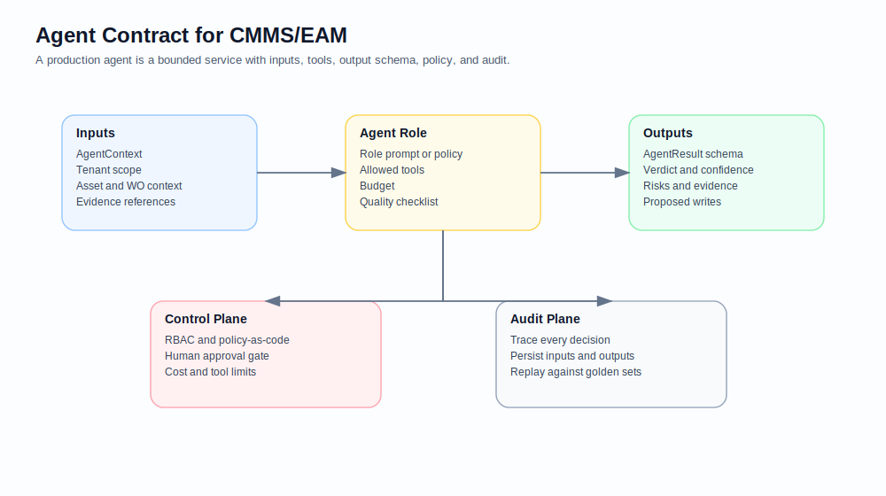

A production CMMS/EAM agent contract should be explicit. The model should not be allowed to invent fields, skip policy, or write outside its scope.

### 7.1 Core objects

| Object | Purpose |
| --- | --- |
| `AgentContext` | Tenant-scoped run context: request, asset, inventory, policies, permissions, retrieval results, budget. |
| `AgentTask` | A bounded assignment given to one agent. |
| `AgentResult` | Typed output: verdict, confidence, severity, evidence, risks, recommended actions, proposed writes. |
| `ToolAction` | A proposed or executed tool call with system, operation, payload, approval requirement, idempotency key. |
| `OrchestrationRun` | The full run ledger: inputs, agents, tool calls, budget, policy decisions, final recommendation, audit. |
| `HumanDecision` | Approval, rejection, modification, escalation, or feedback from an accountable user. |

### 7.2 Example `AgentResult` schema

```json
{
  "agent_name": "Asset",
  "verdict": "Asset risk is elevated; inspection should be planned before auto-closing the request.",
  "confidence": 0.92,
  "severity": "high",
  "evidence": [
    "asset=Air Compressor 04",
    "criticality=4/5",
    "last_pm_days_ago=104",
    "vibration_mm_s=8.1"
  ],
  "risks": [
    "vibration above alarm band",
    "high criticality asset",
    "preventive maintenance is overdue or near overdue"
  ],
  "recommended_actions": [
    "Inspect bearings, coupling alignment, lubrication, and mounting bolts"
  ],
  "proposed_writes": []
}
```

### 7.3 Tool contract

Every tool should declare:

```yaml
name: draft_work_order
system: cmms
side_effect: proposed_write
requires_approval: true
idempotent: true
allowed_roles:
  - maintenance_planner
  - supervisor
input_schema:
  asset_id: string
  description: string
  priority: string
  source: string
audit_fields:
  - run_id
  - request_id
  - user_id
  - tenant_id
  - evidence_ids
```

The tool layer should reject calls that do not match schema, role, tenant, environment, or approval state. This rejection should be recorded as part of the run, not hidden.

### 7.4 Memory design

CMMS/EAM memory should be split into several types:

- **Working memory**: the current run state and agent findings.
- **Factual memory**: asset register, parts, job plans, policies, contracts.
- **Historical memory**: prior work orders, failure events, RCA, PM compliance, MTTR.
- **Episodic memory**: what happened in prior agent runs and how humans corrected them.
- **Evaluation memory**: golden test cases, approved recommendations, rejected recommendations, known failure modes.

Reflexion-style agents use verbal feedback and episodic memory to improve future decisions without immediately changing model weights [8]. In CMMS/EAM, this idea is valuable if feedback remains governed. A rejected recommendation should become a learning signal, but it should not silently rewrite policy.

---

## 8. Governance, safety, and cybersecurity

A future CMMS/EAM platform is part of the operational fabric of a facility. This makes AI governance practical, not philosophical.

### 8.1 Non-negotiable safety rules

1. **No silent writes**: every side effect must be either blocked, drafted, or explicitly approved.
2. **No hidden evidence**: every recommendation should show its source context.
3. **No cross-tenant memory**: one tenant's assets, policies, and failures must not leak to another.
4. **No uncontrolled OT access**: agents should not directly command PLCs, robots, safety systems, or control loops.
5. **No policy waiver by model**: safety, compliance, and RBAC are deterministic gates.
6. **No unsupported diagnosis**: agents should express uncertainty and recommend inspection when evidence is weak.
7. **No irreversible actions without human approval**: purchasing, shutdown, PM interval changes, and safety-impacting actions require accountable review.

### 8.2 Threat model

| Threat | Example | Control |
| --- | --- | --- |
| Prompt injection | A malicious manual says "ignore safety policy" | Retrieval filtering, source trust ranking, policy agent isolation. |
| Tool misuse | Agent tries to create work order without approval | Tool gateway enforces approval state and RBAC. |
| Data leakage | Agent retrieves another tenant's work history | Tenant-scoped retrieval index and access tests. |
| Hallucinated part | Agent invents a part number | Inventory agent must use part master data only. |
| Over-automation | Agent closes a request from weak evidence | Write policy blocks close/complete actions unless approved. |
| Cost runaway | Debate loops keep calling models | Budget caps, max tool calls, timeout, run meter. |
| Audit gap | Recommendation cannot be reconstructed | Persist inputs, outputs, retrieval IDs, tool calls, model config, policy version. |

### 8.3 Industrial cybersecurity

CMMS/EAM often integrates with systems near OT: historians, SCADA data, condition monitoring platforms, gateways, and IIoT streams. ISA/IEC 62443 is relevant because it treats industrial automation and control system security as a lifecycle discipline involving people, hardware, software, and policy [9]. A CMMS/EAM agent platform should inherit that posture.

Practical rules:

- Treat AI tool servers as part of the attack surface.
- Use least privilege service accounts.
- Separate read-only analytic connectors from write-capable connectors.
- Require explicit change-control workflows for anything touching production operations.
- Keep model providers outside direct OT paths.
- Log every retrieved document and tool response.
- Run red-team tests for prompt injection, malicious documents, and tool-call manipulation.

### 8.4 Standards alignment

| Standard or framework | Relevance to agentic CMMS/EAM |
| --- | --- |
| ISO 55000 | Frames asset management as lifecycle value realization and provides vocabulary for asset management systems [2]. |
| ISO 14224 | Provides a basis for reliability and maintenance data collection in asset-intensive industries [14]. |
| ISA/IEC 62443 | Guides security for industrial automation and control systems [9]. |
| NIST AI RMF / GenAI Profile | Helps structure trustworthiness, AI risk management, and evaluation across the AI lifecycle [1]. |
| MIMOSA OSA-CBM | Provides architecture concepts for moving information in condition-based maintenance systems [10]. |

---

## 9. Evaluation methodology

A CMMS/EAM agent system should be evaluated like an operational product, not just like a chatbot.

### 9.1 Offline replay

Start with historical maintenance cases. For each case, reconstruct the information that would have been available at the time: request text, asset record, PM status, inventory, telemetry, policy, and final human action. Run the agent system against that snapshot and compare the recommendation with the actual outcome.

Do not train on the test set. Do not allow future data to leak into the run. A recommendation should be judged against the context available at decision time.

### 9.2 Golden scenarios

Create scenario packs that cover common and risky cases:

| Scenario | What to test |
| --- | --- |
| Noisy compressor | Symptom parsing, asset risk, spare part check, approval gate. |
| Pump seal leak | Safety notes, isolation requirements, part availability. |
| Overdue PM backlog | Prioritization, report thresholds, workload planning. |
| Repeat failure hotspot | Pattern detection and RCA suggestion. |
| Missing asset ID | Intake uncertainty and request for clarification. |
| Out-of-stock critical spare | Inventory risk and procurement draft. |
| Conflicting telemetry | Debate and evidence quality. |
| Malicious document | Prompt injection defense. |
| Cross-tenant query | Data isolation. |
| Live write attempt | Tool gateway and approval enforcement. |

### 9.3 Metrics

| Metric | Why it matters |
| --- | --- |
| Recommendation acceptance rate | Measures usefulness, but can be gamed if users over-trust. |
| Planner time saved | Direct operational value. |
| Evidence completeness | Whether recommendations include enough source context. |
| False write attempt rate | Safety-critical measure; should be near zero. |
| Approval override rate | Shows where policy or confidence thresholds are wrong. |
| Duplicate work-order detection accuracy | Reduces noise and backlog inflation. |
| Part recommendation precision | Prevents bad reservations and purchasing waste. |
| Escalation correctness | Measures whether critical work gets routed properly. |
| Cost per reviewed request | Keeps AI economically viable. |
| Audit replay success | Confirms that decisions can be reconstructed. |

### 9.4 Human review loop

Every human decision should become structured feedback:

```json
{
  "decision": "approved_with_changes",
  "changed_fields": ["priority", "job_plan"],
  "reason": "Planner confirmed abnormal vibration and selected standard compressor inspection job plan.",
  "agent_feedback": {
    "asset_agent": "useful",
    "inventory_agent": "premature reservation suggestion",
    "policy_agent": "correct"
  }
}
```

This feedback should improve prompts, retrieval ranking, thresholds, and agent policies. It should not automatically loosen safety gates.

---

## 10. Product roadmap

A credible product roadmap should avoid jumping from "AI preview" to "autonomous maintenance". The right path is staged.

### Phase 0: Transparent AI preview

- Dashboard summaries and report explanations.
- No live writes.
- Admin feature flags.
- Runtime guards and row limits.
- Basic source display.

This is close to what the AI settings screen suggests.

### Phase 1: Planner review packages

- Intake, asset, inventory, and policy agents.
- Work-order draft suggestions.
- Human approval gate.
- Full run audit.
- Offline evaluation against historical cases.

This is close to what the MAAI screen demonstrates.

### Phase 2: Controlled low-risk writes

- Allow writes only for low-risk, reversible actions.
- Examples: draft work order, add note, attach evidence, route to planner queue.
- Require idempotency keys and audit.
- Keep live completion, closure, purchasing, and safety-impacting changes gated.

### Phase 3: Agent-assisted planning and scheduling

- Labor and skill matching.
- Downtime window suggestions.
- Crew load balancing.
- Part reservation after diagnosis or planner approval.
- Integration with production schedules.

### Phase 4: Reliability strategy agents

- Repeat failure analysis.
- PM optimization proposals.
- RCA draft support.
- Bad actor asset ranking.
- Budget and replacement planning.

### Phase 5: Agentic EAM network

- Cross-site asset learning with privacy controls.
- Vendor and warranty agents.
- Digital twin and what-if maintenance simulations.
- A2A-style interoperability with supplier, contractor, and enterprise agents.
- Formal certification and external audit readiness.

At Phase 5, the CMMS/EAM platform becomes a coordination layer for an ecosystem. But that future is only safe if Phases 0 through 3 establish trust, contracts, and auditability.

---

## 11. Source code included in this repository

This repository includes a deterministic Python proof-of-concept. It mirrors the experimental interface at a small scale: a request for "Compressor noisy" is reviewed by Intake, Asset, Inventory, and Policy agents. The result is a review package with blocked writes and planned audit.

### 11.1 Repository structure

```text
.
|- README.md
|- PAPER.md
|- assets/
|  |- experimental-maai-poc.png
|  |- experimental-ai-settings.png
|  |- future-cmms-eam-mas-architecture.svg
|  |- agentic-work-order-lifecycle.svg
|  |- agent-contract.svg
|  |- mas-value-loop-expanded.svg
|  |- made-in-china-2025-agentic-eam-roadmap.svg
|  |- china-industrial-exemplars.svg
|  |- maintenance-use-case-leverage-matrix.svg
|  |- china-agentic-eam-fit-heatmap.svg
|  `- industrial-maintenance-data-flywheel.svg
|- data/
|  |- china_industrial_examples.json
|  |- use_case_scores.json
|  `- made_in_china_2025_mapping.json
|- docs/
|  |- architecture-deep-dive.md
|  |- agent-contracts.md
|  |- evaluation-and-safety.md
|  |- product-roadmap.md
|  |- china-made-in-china-2025-and-agentic-eam.md
|  |- china-real-life-examples.md
|  |- visuals-and-charts.md
|  `- source-code-walkthrough.md
|- examples/requests/compressor_noisy.json
|- scripts/
|  `- generate_figures.py
|- src/maai_cmms_demo/
|  |- agents.py
|  |- china_cases.py
|  |- cli.py
|  |- models.py
|  |- orchestrator.py
|  `- sample_data.py
`- tests/
   |- test_orchestrator.py
   `- test_china_examples.py
```

### 11.2 Run the demo

```bash
cd MAAI-CMMS
PYTHONPATH=src python -m maai_cmms_demo --input examples/requests/compressor_noisy.json
```

Expected output:

```text
Experimental CMMS demo run
Input: Compressor noisy
Budget used: 16%
Recommendation confidence: 88%
Automation risk: 28%
Write action: blocked
Approval required: True
```

The exact run ID changes each time. The important point is that the system produces structured findings and blocks live writes.

### 11.3 Run tests

```bash
cd MAAI-CMMS
PYTHONPATH=src python -m unittest discover -s tests -v
```

### 11.4 What the code demonstrates

- Agent boundaries are explicit.
- Outputs are typed dataclasses.
- Tool actions are proposed, not executed.
- The policy agent blocks writes when the tenant requires approval or live writes are disabled.
- The orchestrator records budget, tool calls, findings, recommendation, and audit metadata.
- The implementation can later swap deterministic logic for LLM-backed agents without changing the contract.

### 11.5 What the code does not do

- It does not call any LLM provider.
- It does not connect to a real CMMS/EAM database.
- It does not create work orders.
- It does not reserve parts.
- It does not connect to OT systems.
- It is not a safety-certified workflow.

That is intentional. The code is a contract-first skeleton for a production architecture.

### 11.6 Regenerate the charts

The primary figures are not hand-edited screenshots. They are generated from small data files so the paper can be reviewed like code:

```bash
cd MAAI-CMMS
python scripts/generate_figures.py
```

The generator has no third-party dependencies. It reads:

- `data/china_industrial_examples.json`
- `data/use_case_scores.json`
- `data/made_in_china_2025_mapping.json`

It writes these SVGs into `assets/`:

- `mas-value-loop-expanded.svg`
- `china-industrial-exemplars.svg`
- `made-in-china-2025-agentic-eam-roadmap.svg`
- `maintenance-use-case-leverage-matrix.svg`
- `china-agentic-eam-fit-heatmap.svg`
- `industrial-maintenance-data-flywheel.svg`

The China scoring data is intentionally labeled as analytical and illustrative. It should be calibrated with real tenant data before being used for a commercial product decision.

---


## 12. Made in China 2025 and real-world Chinese industrial examples

The official policy phrase is **Made in China 2025**. This paper also refers to the broader move from manufacturing capacity to intelligent manufacturing capability. That distinction matters: the policy direction creates the macro pressure, while the industrial reality creates the maintenance problem.

The State Council issued Made in China 2025 in 2015 as the first decade of a larger manufacturing-power strategy [20]. Public government summaries describe strategic tasks such as innovation, integration of informatization and industrialization, industrial foundation strengthening, quality and brand improvement, green manufacturing, service-oriented manufacturing, and breakthroughs in key sectors [21]. The ten priority sectors include next-generation IT, high-end CNC and robotics, aerospace equipment, ocean engineering equipment and high-tech ships, advanced rail transit, energy-saving and new-energy vehicles, power equipment, agricultural machinery, new materials, and biomedicine/high-performance medical devices [21].

For CMMS/EAM, the message is direct: future maintenance is not only about recording work orders. It is about governing connected assets in environments where equipment is more instrumented, failure consequences are higher, safety and compliance are stricter, and downtime is more expensive. That is exactly where multi-agent AI becomes useful.


### 12.1 Why China is a strong proving ground

China offers a rare combination for agentic CMMS/EAM:

- **Huge installed asset base.** Smart factories, utilities, logistics, rail systems, petrochemical plants, steel production, power equipment, HVAC systems, and battery plants create many asset classes and failure modes.
- **Fast industrial digitalization.** Industrial Internet, 5G, cloud, edge computing, robotics, machine vision, and digital twins are entering factory and infrastructure operations.
- **Policy pressure toward intelligent manufacturing.** Made in China 2025 makes manufacturing quality, digitalization, green development, and high-end equipment long-term strategic priorities [20][21].
- **Reliability and safety pressure.** Rail, grid, process, steel, energy, and high-end manufacturing environments need explainable decisions and strong approval gates.
- **Human-in-the-loop automation opportunity.** China-scale operations need AI leverage, but safety-critical industries still require human accountability, permits, procedures, and audit trails.

This makes China a practical testbed for the paper's core thesis: **agents may recommend and draft by default; agents may write only when policy, risk, role, tenant setting, reversibility, and audit evidence allow it.**

### 12.2 Real-life examples and what they imply

The following examples are based on public company or ecosystem materials. They do not claim that these companies already run the exact MAS architecture proposed here. They show why the proposed architecture is realistic and timely.


| Example | Public signal | CMMS/EAM implication |
| --- | --- | --- |
| **Midea / MBT** | Midea Building Technologies describes its Chongqing site as a full-process AI-empowered chiller lighthouse factory [22]. | Chillers and compressors connect asset health, energy use, quality, parts, and after-sales service. This is ideal for an Asset Agent, Energy Agent, Inventory Agent, and Service Agent working from the same evidence package. |
| **SANY Group** | SANY describes Changsha No. 18 Factory as a 100,000-square-meter intelligent manufacturing pilot factory approved by MIIT [23]. | Heavy equipment combines factory maintenance, field telemetry, warranty, and service parts. MAS can link factory asset history with field-service recommendations. |
| **State Grid** | State Grid Jiangsu describes drone autonomous inspection, AI defect recognition, work-order dispatch to equipment-management units, and large-scale drone deployment; State Grid/EPRI also describes AI datasets for transmission-line drone inspection [30][31]. | Grid maintenance is inspection-heavy, geographically distributed, and safety-critical. Vision, asset-risk, policy, scheduling, and dispatch agents should collaborate before a work order is approved. |
| **CRRC** | CRRC describes SmartCare intelligent O&M integrating vehicle and ground data for lifecycle services that improve safety and reduce maintenance cost [25]. | Rail fleets require lifecycle history, safety approval, configuration control, spare readiness, and explainable decisions. A single assistant should not own all of these responsibilities. |
| **Huawei Enterprise** | Huawei's fully connected factory materials emphasize industrial equipment connectivity, IT/OT convergence, visualized OT networks, and data support for upper-layer intelligent applications [26]. | Agentic EAM depends on clean data paths, reliable integration, and governed tool access. Connectivity is the substrate for agent reasoning. |
| **Sinopec** | Sinopec describes smart-factory construction based on the Sinopec Smart Cloud industrial Internet platform, plus digital and intelligent transformation of refining and chemical enterprises [35][36]. | Process plants are strong cases for policy-aware maintenance, shutdown planning, permits, MRO coordination, and safety gates. Agents can prepare the package; formal workflows approve the action. |
| **Haier COSMOPlat** | Haier describes COSMOPlat as an industrial Internet platform covering intelligent factory construction, industrial intelligent technology, software/hardware integration, and energy management [32]. | Industrial Internet patterns can support cross-factory maintenance knowledge, standardized work instructions, energy-aware maintenance, and feedback loops. |
| **Baowu / Baosteel** | Baosteel presents BaoVision online surface inspection technology; public summaries describe Baowu's broader digital and intelligent transformation [33][34]. | Steel production connects quality, process stability, equipment condition, safety, and energy consumption. MAS can link online inspection defects to maintenance, root-cause analysis, and reliability improvement. |


### 12.3 Five concrete MAS scenarios inspired by Chinese industry

#### Scenario A: AI-enabled chiller reliability

A Midea-like chiller factory or installed chiller base creates a rich agentic maintenance problem. A vibration alarm is not merely a work order. It can indicate bearing wear, alignment issues, lubrication problems, energy waste, warranty exposure, or downstream cooling risk. The correct output is a package: evidence, failure hypotheses, energy impact, parts status, and policy gates.

#### Scenario B: Heavy-equipment factory-to-field service loop

A SANY-like heavy-equipment environment links factory production, field telemetry, service teams, dealers, and spare parts. A future CMMS/EAM MAS can let a Fleet Agent detect a pattern, an Asset Agent compare similar equipment histories, an Inventory Agent check regional spares, and a Contract Agent determine whether warranty or service-level terms apply.

#### Scenario C: Drone inspection to governed grid work order

A State Grid-like workflow can start with drone images. A Vision Agent identifies a defect candidate. An Asset Agent checks tower, line, voltage level, location, weather exposure, and history. A Policy Agent checks safety restrictions and approval requirements. A Scheduler Agent proposes route and crew. The final result is a human-reviewable work package.

#### Scenario D: Rail fleet lifecycle O&M

A CRRC-like rail fleet needs a long memory: configuration, operating conditions, prior failures, maintenance history, parts, depots, safety rules, and lifecycle cost. A MAS architecture prevents a single model from flattening these concerns. Disagreement between the Safety Agent and the Schedule Agent should be treated as useful evidence, not friction.

#### Scenario E: Process-plant shutdown planning

A Sinopec-like process plant sits in the high-impact/high-complexity quadrant. Agents can assist with scope capture, work-package completeness, parts readiness, permit checks, contractor readiness, and risk review. Live changes to shutdown scope, safety procedures, or isolation requirements should remain blocked unless a formal workflow approves them.


### 12.4 What an experimental next-generation CMMS system should learn from these examples

The product lesson is not to build a generic chatbot for factories. It is to make the platform a **maintenance intelligence control plane**:

1. Every recommendation is grounded in asset, history, part, policy, and user context.
2. Every agent has a visible role and bounded tool set.
3. Every write action is classified as draft-only, review-required, allowed, or blocked.
4. Every recommendation includes evidence and uncertainty.
5. Every human decision becomes structured feedback.
6. Every tenant can tune budget, runtime, feature flags, and automation thresholds.

The end state is a trustworthy industrial data flywheel: signals become context, context feeds agents, agents prepare review packages, humans approve or reject, outcomes update the knowledge base, and the next run gets better.


For deeper detail, see:

- [`docs/china-made-in-china-2025-and-agentic-eam.md`](docs/china-made-in-china-2025-and-agentic-eam.md)
- [`docs/china-real-life-examples.md`](docs/china-real-life-examples.md)
- [`docs/visuals-and-charts.md`](docs/visuals-and-charts.md)

---

## 13. Visual appendix: graphs and charts

This update adds both presentation-style PNG infographics and editable SVG charts. The SVG files are the canonical GitHub figures because they are small, readable, and generated from source data. The PNG renders in `assets/renders/` are useful for slides and social previews.

### 13.1 Canonical SVG figures

| Figure | File | Purpose |
| --- | --- | --- |
| Multi-agent value loop | `assets/mas-value-loop-expanded.svg` | Explains the end-to-end platform loop from signal intake to learning feedback. |
| Made in China 2025 roadmap | `assets/made-in-china-2025-agentic-eam-roadmap.svg` | Maps policy foundation to future agentic EAM. |
| Chinese industrial exemplars | `assets/china-industrial-exemplars.svg` | Summarizes public Chinese company examples and MAS relevance. |
| Maintenance leverage matrix | `assets/maintenance-use-case-leverage-matrix.svg` | Prioritizes near-term wins versus high-governance scenarios. |
| China fit heatmap | `assets/china-agentic-eam-fit-heatmap.svg` | Shows qualitative structural fit by company and dimension. |
| Data flywheel | `assets/industrial-maintenance-data-flywheel.svg` | Shows how outcomes continuously improve the platform. |

### 13.2 Presentation-style PNG renders

The repository also includes PNG renders under `assets/renders/`:

- `future_cmms_eam_value_loop_diagram.png`
- `made_in_china_2025_roadmap_infographic.png`
- `chinese_industrial_companies_and_mas_for_cmms_eam.png`
- `multi_agent_ai_in_maintenance_optimization.png`

### 13.3 Figure source code

All canonical editable charts can be regenerated from source data:

```bash
python scripts/generate_figures.py
```

The chart data is intentionally simple and auditable. `data/china_industrial_examples.json` contains public-source summaries and future CMMS/EAM interpretations. `data/use_case_scores.json` contains illustrative prioritization scores. `data/made_in_china_2025_mapping.json` contains the policy-to-platform roadmap text.

---

## 14. Closing argument

The most valuable future CMMS/EAM AI will not be the assistant that writes the most confident paragraph. It will be the system that knows when not to write.

Maintenance work is physical, financial, and operational. A wrong recommendation can waste a technician's time. A wrong part reservation can delay a line. A wrong priority can hide a critical failure. A wrong integration can create a cybersecurity path. For that reason, the future should not be framed as "AI replaces maintenance planners." A better framing is: **AI prepares the decision surface; humans retain accountability; policy controls side effects; the platform learns from outcomes.**

Multi-agent systems fit CMMS/EAM because maintenance itself is multi-agent. Operators, technicians, planners, storeroom staff, reliability engineers, supervisors, vendors, finance teams, and safety teams already collaborate. The AI architecture should mirror that reality in software: specialized roles, shared context, clear handoffs, visible disagreements, and controlled action.

This experimental concept is promising because it starts in the right place: agents collaborate, the run meter is visible, the review package is the output, and human approval blocks writes. That is not a limitation. It is the foundation of trust.

---

## References

[1] NIST, *Artificial Intelligence Risk Management Framework: Generative Artificial Intelligence Profile*, NIST AI 600-1, 2024. https://www.nist.gov/publications/artificial-intelligence-risk-management-framework-generative-artificial-intelligence

[2] ISO, *ISO 55000:2024 Asset management - Vocabulary, overview and principles*, 2024. https://www.iso.org/standard/83053.html

[3] IBM, *CMMS vs. EAM: Two asset management tools that work great together*. https://www.ibm.com/think/topics/cmms-vs-eam

[4] Qingyun Wu et al., *AutoGen: Enabling Next-Gen LLM Applications via Multi-Agent Conversation*, arXiv:2308.08155, 2023. https://arxiv.org/abs/2308.08155

[5] Yilun Du et al., *Improving Factuality and Reasoning in Language Models through Multiagent Debate*, arXiv:2305.14325, 2023. https://arxiv.org/abs/2305.14325

[6] Patrick Lewis et al., *Retrieval-Augmented Generation for Knowledge-Intensive NLP Tasks*, arXiv:2005.11401, 2020. https://arxiv.org/abs/2005.11401

[7] Shunyu Yao et al., *ReAct: Synergizing Reasoning and Acting in Language Models*, arXiv:2210.03629, 2022/2023. https://arxiv.org/abs/2210.03629

[8] Noah Shinn et al., *Reflexion: Language Agents with Verbal Reinforcement Learning*, arXiv:2303.11366, 2023. https://arxiv.org/abs/2303.11366

[9] ISA Global Cybersecurity Alliance, *Quick Start Guide: An Overview of ISA/IEC 62443 Standards*, 2023. https://isasecure.org/hubfs/2023%20ISA%20Website%20Redesigns/ISAGCA/PDFs/ISAGCA%20Quick%20Start%20Guide%20FINAL.pdf

[10] MIMOSA, *Open System Architecture for Condition-Based Maintenance (OSA-CBM)*. https://www.mimosa.org/mimosa-osa-cbm/

[11] Sirui Hong et al., *MetaGPT: Meta Programming for A Multi-Agent Collaborative Framework*, arXiv:2308.00352, 2023/2024. https://arxiv.org/abs/2308.00352

[12] Taicheng Guo et al., *Large Language Model based Multi-Agents: A Survey of Progress and Challenges*, IJCAI 2024. https://www.ijcai.org/proceedings/2024/890

[13] Panagiotis Mallioris, Eirini Aivazidou, Dimitrios Bechtsis, *Predictive maintenance in Industry 4.0: A systematic multi-sector mapping*, CIRP Journal of Manufacturing Science and Technology, 2024. https://www.sciencedirect.com/science/article/pii/S1755581724000221

[14] ISO, *ISO 14224:2016 Petroleum, petrochemical and natural gas industries - Collection and exchange of reliability and maintenance data for equipment*. https://www.iso.org/standard/64076.html

[15] Anthropic, *Introducing the Model Context Protocol*, 2024. https://www.anthropic.com/news/model-context-protocol

[16] Google Developers Blog, *Announcing the Agent2Agent Protocol (A2A)*, 2025. https://developers.googleblog.com/en/a2a-a-new-era-of-agent-interoperability/

[17] OpenAI, *OpenAI Agents SDK documentation*. https://openai.github.io/openai-agents-python/

[18] LangChain, *LangGraph: Agent Orchestration Framework for Reliable AI Agents*. https://www.langchain.com/langgraph

[19] ICLR Blogposts, *Multi-LLM-Agents Debate - Performance, Efficiency, and Scaling*, 2025. https://iclr-blogposts.github.io/2025/blog/mad/

[20] State Council of the People's Republic of China, *Notice on Issuing Made in China 2025*, 2015. https://www.gov.cn/zhengce/content/2015-05/19/content_9784.htm

[21] Ministry of Finance of the People's Republic of China, public summary of Made in China 2025 strategic tasks and priority sectors, 2015. https://www.mof.gov.cn/zhengwuxinxi/caizhengxinwen/201505/t20150519_1233749.htm

[22] Midea Building Technologies, *AI+Zero-carbon: The World's First Fully AI-Powered Chiller Lighthouse Factory*. https://mbt.midea.com/global/news/ai-zero-carbon--the-world-s-first-fully-ai-powered-chiller-light

[23] SANY Group, *No. 18 Factory is one of the smartest lighthouse factories in the global heavy industry*. https://www.sanyglobal.com/video/145/

[24] State Grid / NARI Group, *Deepening AI technology applications to build new productive capacity in the energy-power sector*, 2025. https://www.sgepri.sgcc.com.cn/html/sgepri/gb/xwzx/zbdt/20250417/386435202504170839000002.shtml

[25] CRRC, *CRRC Launches Two Innovative Green Intelligent Trains at InnoTrans 2024*. https://www.crrcgc.cc/en/2024-09/27/article_2024092715480084389.html

[26] Huawei Enterprise, *Fully-Connected Factory Solution*. https://e.huawei.com/en/industries/manufacturing/production-and-supply/fully-connected-smart-factory

[27] Sinopec Group, *Driving Scientific and Technological Innovation*. https://www.sinopecgroup.com/group/en/000/000/067/67304.shtml

[28] Haier, *COSMOPlat*. https://www.haier.com/global/haier-ecosystem/cosmoplat/

[29] CATL, *Smart Manufacturing*. https://www.catl.com/en/manufacture/

[30] State Grid Jiangsu, *Drone-based power-grid inspection and AI-enabled operations and maintenance*, 2025. https://www.js.sgcc.com.cn/xwzx/jcdt/2025/287.shtml

[31] State Grid / EPRI, *Corporate achievement selected among high-quality AI dataset and model-construction results*, 2025. https://www.epri.sgcc.com.cn/html/chinasperi/gb/jyyw2/xyzx/20250515/856984202505151254000001.shtml

[32] Haier, *COSMOPlat*. https://www.haier.com/global/haier-ecosystem/cosmoplat/

[33] Baosteel, *Online Surface Inspection Technology for High Speed Hot Wire*. https://rd.baosteel.com/zypt//en/ability/see/abilityDetailsBSSF1/2/19b24dcfb0f747e581d919c6186a6880

[34] English.gov.cn / Xinhua, *Sci-tech innovation injects new energy into high-quality development*, 2024. https://english.www.gov.cn/news/202406/23/content_WS66782834c6d0868f4e8e8774.html

[35] Sinopec Group, *Strengthening innovation drivers*. https://www.sinopecgroup.com/group/en/000/000/041/41714.shtml

[36] Sinopec Group, *Empowering digital production through technological innovation*. https://www.sinopecgroup.com/group/en/000/000/065/65832.shtml

[37] Midea Industrial Technology. https://industry.midea.com/en


