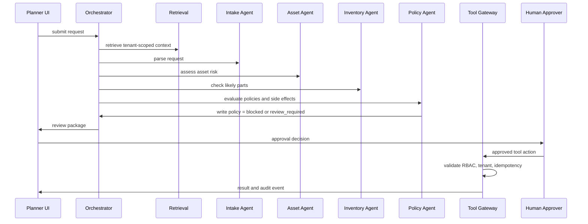

# Architecture Deep Dive

This document expands the reference architecture from the main paper into implementation-level design choices.

## 1. Design goals

A multi-agent CMMS/EAM architecture should optimize for five properties:

1. **Operational usefulness**: recommendations must reduce planner and technician effort.
2. **Auditability**: every recommendation must be reconstructable after the fact.
3. **Governability**: tenant settings, RBAC, policy, and budgets must be enforced outside the model.
4. **Extensibility**: new agents and tools can be added without rewriting the product.
5. **Safety under partial failure**: when an LLM, retrieval index, or integration is unavailable, the CMMS/EAM system continues to work.

## 2. Runtime flow

A production run can be implemented as an event-driven state machine:



## 3. Orchestration choices

### 3.1 Sequential orchestration

Sequential orchestration is easiest to reason about. Intake runs first, then asset, inventory, policy, and synthesis. It is appropriate for early versions and high-risk workflows because each step can inspect prior findings.

### 3.2 Parallel orchestration

Asset, inventory, and knowledge retrieval can often run in parallel once the intake agent extracts asset and symptom fields. This lowers latency but requires stronger conflict handling.

### 3.3 Hierarchical orchestration

A supervisor agent or deterministic workflow controller delegates tasks to specialist agents. This is useful when a request may branch into multiple workflows, such as emergency maintenance, planned corrective work, warranty claim, or vendor dispatch.

### 3.4 Event-sourced orchestration

For audit-heavy CMMS/EAM systems, each run should be event-sourced. Store every state transition:

- request received
- context retrieved
- agent started
- agent result persisted
- tool action proposed
- policy decision made
- human approval requested
- write executed or blocked
- feedback recorded

This makes offline replay and compliance review much easier.

## 4. Tool gateway

The tool gateway is the most important safety boundary. Agents should never call production systems directly. They call a gateway that enforces schema, authorization, tenant scope, side-effect rules, and idempotency.

Recommended gateway checks:

| Check | Description |
| --- | --- |
| Schema validation | Reject malformed payloads before they reach business systems. |
| Tenant scope | Ensure the tool call can only access objects inside the tenant and site boundary. |
| RBAC | Enforce the human or service role behind the agent run. |
| Approval state | Block write-capable tools unless the current run has the required approval. |
| Idempotency | Prevent duplicate work orders, duplicate reservations, and repeated notifications. |
| Rate and cost limit | Prevent runaway loops or abuse. |
| Audit emission | Persist the tool request, decision, and response. |

## 5. Retrieval and grounding

The retrieval layer should be built around trusted sources, not general web search.

Recommended indexes:

- Asset manuals and vendor documentation.
- Site SOPs and safety procedures.
- Standard job plans and checklists.
- Work-order history and technician notes.
- Root cause analysis reports.
- PM schedules and compliance records.
- Inventory catalog, BOM, and compatible parts.
- Policy and approval rules.

Each retrieved item should include a source ID, tenant ID, version, timestamp, access scope, and trust tier. Agents should include source IDs in their results so the UI can show evidence.

## 6. Multi-tenant design

A CMMS/EAM platform is usually multi-tenant. Agentic AI increases the need for strong isolation.

Minimum controls:

- Separate retrieval namespaces per tenant.
- Tenant ID required in every tool call.
- No cross-tenant examples in prompts unless anonymized and explicitly allowed.
- Model output filters for tenant identifiers and sensitive data.
- Per-tenant provider configuration.
- Per-tenant budget and run limits.
- Per-tenant feature flags and kill switches.

## 7. Provider abstraction

Do not hardwire the platform to one model provider. Use a provider interface:

```python
class LLMProvider:
    def complete(self, *, messages, response_schema, temperature, timeout_s):
        ...
```

The orchestrator should not know whether the provider is OpenAI, Anthropic, DeepSeek, local, or deterministic. Provider differences belong in adapters. Safety gates, schemas, budgets, and audit should remain platform-owned.

## 8. Recommended deployment topology

```text
Browser / Mobile UI
        |
API Gateway and Auth
        |
CMMS Application Services
        |
Agent Orchestrator ---- Retrieval Service ---- Vector / Search Index
        |                       |
        |                       +---- Document Store
        |
Tool Gateway ---- CMMS DB / EAM API / Inventory / ERP / Historians
        |
Audit and Evaluation Store
```

Separate the agent runtime from core CMMS transaction services. This keeps the core product stable when AI dependencies fail.

## 9. Failure modes and fallbacks

| Failure | Expected behavior |
| --- | --- |
| LLM provider unavailable | Fall back to heuristic summaries or disable AI recommendations. |
| Retrieval unavailable | Do not make grounded recommendations; ask for manual review. |
| Tool gateway rejects write | Show rejection reason and keep review package. |
| Budget exceeded | Stop agent loop and produce partial result with warning. |
| Low confidence | Ask for missing data or route to human review. |
| Conflicting agents | Show disagreement instead of hiding it. |

## 10. Architecture principle

A CMMS/EAM agent runtime should behave like a careful junior planner with perfect note-taking and strict permissions, not like an invisible automation script.
